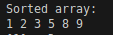
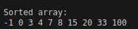
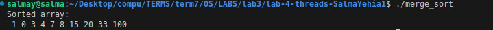
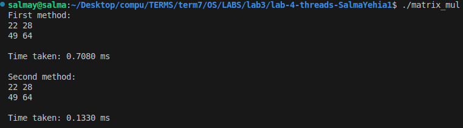

# Pthreads – Merge Sort & Matrix Multiplication

## Part 1: Merge Sort
- **Algorithm:** Divide-and-conquer, O(n log n).  
- **Threads:** Each half of the array is sorted by **two separate threads** recursively.  The main thread is responsible for merging the sorted sub-arrays.
- **Input:** Read from a file named `input`.  
- **Output:** Sorted array.

**Run test cases:**

  
  
  

---

## Part 2: Matrix Multiplication
- **Variations:**
  1. **One thread per element** – each thread calculates a single element of the result matrix.  
  2. **One thread per row** – each thread calculates a full row of the result matrix.  
- **Input:** Read two matrices from a file named `matrices_input.txt`.  
- **Output:** Result matrix and total time taken for each method.

**Run test cases:**

  
  

---

## Compile & Run
```bash
make
./merge_sort
./matrix_mul
